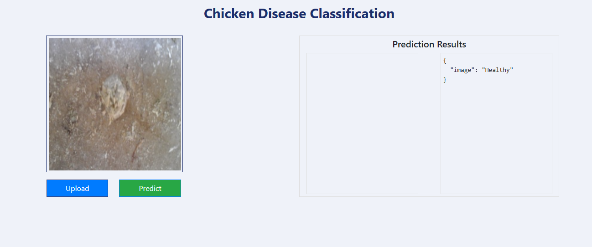
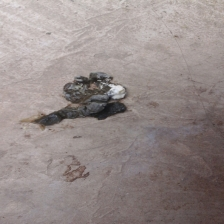
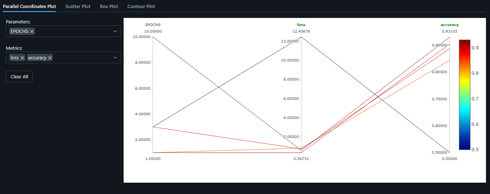

# chicken-disease-classification-
## A web app Can be used by poultry farm to check the health of chickens

**Data Source:** [Dataset](https://www.kaggle.com/datasets/allandclive/chicken-disease-1)

---

## ⚠️ Important Note  

The original dataset contains **5 classes of chicken disease**, but due to computational constraints, this project focuses on training the model with **2 classes only (Healthy, Coccidiosis)**. Despite this limitation, the model maintains reasonable predictive performance.

and got 93% accuracy 

---

DagsHub: [Dagshub url](https://dagshub.com/kapishashtankar10/chicken-disease-classification-/experiments)

# How to run?
### STEPS:

Clone the repository

```bash
https://github.com/kapishash/chicken-disease-classification-.git
```
### STEP 01- Create a conda environment after opening the repository

```bash
conda create -n cnncls python=3.8 -y
```

```bash
conda activate cnncls
```


### STEP 02- install the requirements
```bash
pip install -r requirements.txt
```


```bash
# Finally run the following command
python app.py
```

Now,
```bash
open up you local host and port
```

web based chicken disease prediction app



To train the Model 'http://127.0.0.1:8080/train'

dump of healthy chicken



dump of Coccidiosis disease chicken


```
used **Mlflow** to levrage experiment tracking
```

URL: [Click Here](https://dagshub.com/kapishashtankar10/chicken-disease-classification-.mlflow/#/compare-runs?runs=[%223f1849d0a33745bda8b5a908478549cf%22,%227e512acc51a94b6a82cd4f1cbadc105c%22,%220e7656a055584b96b80483cd20bc4198%22,%2223f2a7b08bfa4a769a70fc3d5bd2aca3%22,%2221a1a69b893a4e889c7180a8ec5e06d6%22]&experiments=[%220%22])


